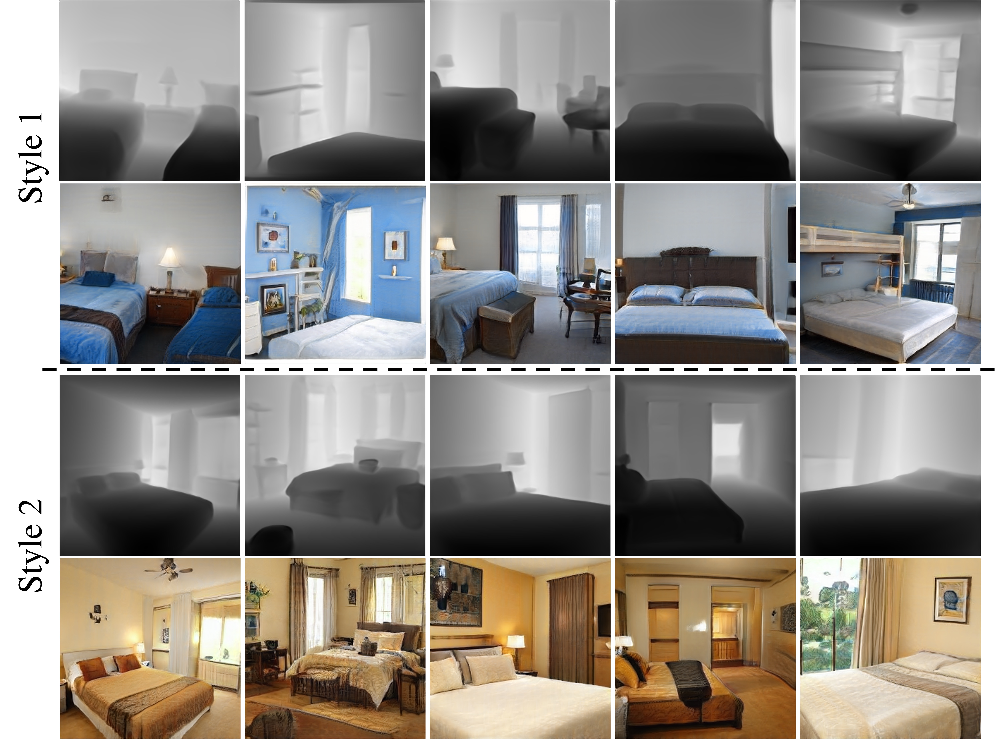

# 3D-Aware Indoor Scene Synthesis with Depth Priors


**Figure:** *Left: High-fidelity images with the corresponding depths generated by DepthGAN. Right: The 3D reconstruction results.*

> **3D-Aware Indoor Scene Synthesis with Depth Priors** <br>
> Zifan Shi, Yujun Shen, Jiapeng Zhu, Dit-Yan Yeung, Qifeng Chen <br>
> *European Conference on Computer Vision (ECCV) 2022 (Oral)*

[[Paper](https://arxiv.org/pdf/2202.08553.pdf)]
[[Project Page](https://vivianszf.github.io/depthgan)]
[[Demo](https://youtu.be/RMmIso5Oxno)]

Existing methods fail to learn high-fidelity 3D-aware indoor scene synthesis merely from 2D images. In this work, we fill in this gap by proposing **DepthGAN**, which incorporates depth as a 3D prior. Concretely, we propose a *dual-path generator*, where one path is responsible for depth generation, whose intermediate features are injected into the other path as the condition for appearance rendering. Such a design eases the 3D-aware synthesis with explicit geometry information. Meanwhile, we introduce a *switchable discriminator* both to differentiate real *v.s.* fake domains, and to predict the depth from a given input. In this way, the discriminator can take the spatial arrangement into account and advise the generator to learn an appropriate depth condition. Extensive experimental results suggest that our approach is capable of synthesizing indoor scenes with impressively good quality and 3D consistency, significantly outperforming state-of-the-art alternatives.


### Environment
The respository is built upon [Hammer](https://github.com/bytedance/Hammer). Please follow the instructions for environment setup.

### Data preparation
We use [LeRes](https://github.com/aim-uofa/AdelaiDepth/tree/main/LeReS) to extract the depth image for each RGB image in LSUN Bedroom and LSUN Kitchen. 

### Training

The training can be started with the following command:

```Shell
./scripts/training_demos/depthgan_lsun_bedroom128.sh \
    ${NUM_GPUS} \
    ${DATASET_PATH} \
    ${ANNOTATION_FOR_TRAIN} \
    ${ANNOTATION_FOR_VAL} \
    [OPTIONS]
```
where
- `NUM_GPUS` refers to the number of GPUS for training (*e.g.*, 8).
- `DATASET_PATH` refers to the path to dataset.
- `ANNOTATION_FOR_TRAIN` refers to the path of annotation file for training data.
- `ANNOTATION_FOR_VAL` refers to the path of annotation file for validation data.
- `OPTIONS` refers to any additional options. You can find the details of other options via `python train.py depthgan --help`.


### Test

The pre-trained models are available [here](https://hkustconnect-my.sharepoint.com/:f:/g/personal/zshiaj_connect_ust_hk/EtnRoicIY-ZMszYfLMvvPuMBWIH-2LWP3hyIr6uex29XHw?e=NUrsFg).

To test the models, you can use the command:
```Shell
./scripts/test_metrics_depthgan.sh \
    ${NUM_GPUS} \
    ${DATASET_PATH} \
    ${ANNOTATION_FOR_TEST} \
    ${METRICS} \
    [OPTIONS]
```
where
- `NUM_GPUS` refers to the number of GPUS for the test (*e.g.*, 1).
- `DATASET_PATH` refers to the path to dataset.
- `ANNOTATION_FOR_TEST` refers to the path of annotation file for test data.
- `METRICS` refers to the name(s) of evaluation metric(s) to use. It can be one of "fid_rgb,fid_depth,snapshot,rotation,video" or the combinations among them.
- `OPTIONS` refers to any additional options. You can find the details of other options via `python test_metrics_depthgan.py depthgan --help`.


## Results

Qualitative comparison between **DepthGAN** and existing alternatives.


Diverse synthesis via varying the appearance latent code, conditioned on the same depth image.


Diverse geometries via varying the depth latent code, rendered with the same appearance style.




## BibTeX

```bibtex
@article{shi20223daware,
  title   = {3D-Aware Indoor Scene Synthesis with Depth Priors},
  author  = {Shi, Zifan and Shen, Yujun and Zhu, Jiapeng and Yeung, Dit-Yan and Chen, Qifeng},
  booktitle = {ECCV},
  year    = {2022}
}
```
